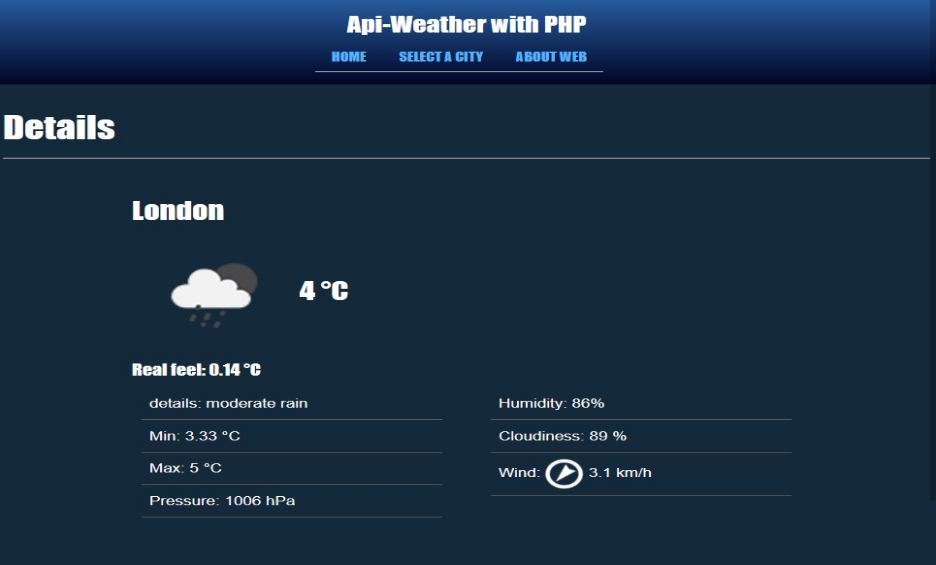

## Consumo APIREST con PHP

Se trata de una práctica de consumo de API REST desde el servidor utilizando PHP Curl. El servidor para realizar los pedidos en esta práctica es [openweathermap.org](https://openweathermap.org/). Éste devuelve información del clima actual de la ciudad seleccionada. Tiene una lista pequeña de ciudades en concepto de prueba, un json con una lista de ciudades y sus id para realizar los pedidos. Actualmente la app está en desarrollo.

##### Lenguajes y materiales:
- HTML, CSS y Javascript
- Bootstrap
- PHP
- WAMP (testeo)
- Visual Studio Code (IDE)
- phpDetEnv (variables de entorno) 

